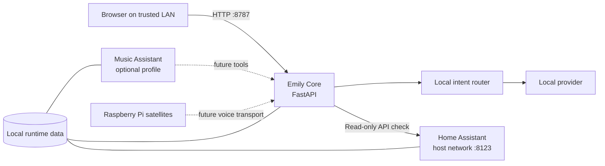

# Emily

Emily is an open-source, local-first voice assistant intended to become a practical Siri or Alexa replacement. It runs on a home server and will eventually connect to small Linux and Raspberry Pi voice satellites. This repository currently contains **Emily Core v0.1**: the safe, headless infrastructure foundation, without microphone streaming or wake-word detection.

The current release provides a FastAPI core, a mobile-friendly local chat page, deterministic offline intents, read-only Home Assistant connectivity checks, optional Music Assistant infrastructure, Docker Compose lifecycle management, and backup/recovery tools. It uses no paid API and sends no analytics.

> [!WARNING]
> Emily v0.1 has no authentication. Use it only on a trusted private LAN or through Tailscale. Never forward ports 8787 or 8123 through your router or expose them directly to the internet.

## Architecture



## Requirements

- A headless Linux server; Ubuntu 22.04 or newer is recommended
- A 64-bit x86 or ARM CPU
- 2 GB RAM minimum; 4 GB or more recommended for Home Assistant and future local AI
- 5 GB free disk minimum, plus room for Home Assistant history, music metadata, and backups
- Docker Engine with the Docker Compose plugin
- Git and either `curl` or `wget`
- A user account allowed to run Docker

No microphone, speaker, Raspberry Pi, GPU, or API subscription is needed for v0.1.

## Quick installation

```bash
git clone https://github.com/AmirIqbal1/emily-assistant.git
cd emily-assistant
./scripts/install.sh
```

The installer checks prerequisites, creates local runtime directories, copies `.env.example` to `.env` only when needed, builds Emily Core, starts the default stack, and waits for the health endpoint. It never installs Docker or overwrites an existing `.env`.

Open `http://SERVER-IP:8787` for Emily and `http://SERVER-IP:8123` for Home Assistant. Home Assistant can take several minutes on its first start.

## Manual installation

```bash
cp .env.example .env
chmod 600 .env
mkdir -p runtime/emily runtime/homeassistant backups
docker compose build emily-core
docker compose up -d
docker compose ps
curl --fail http://127.0.0.1:8787/health
```

Edit `.env` to change the timezone, port, assistant name, log level, service images, or Home Assistant connection. Never commit this file. Image variables make it possible to pin or mirror Home Assistant and Music Assistant images.

## Home Assistant setup

1. Open `http://SERVER-IP:8123` and complete Home Assistant's onboarding flow.
2. In Home Assistant, select your profile in the lower-left corner.
3. Open the **Security** tab, find **Long-lived access tokens**, and choose **Create token**.
4. Name it `Emily`, copy it immediately, and store it in a password manager.
5. Edit Emily's `.env` and set `HOME_ASSISTANT_TOKEN=the-token-you-copied`.
6. Apply it with `docker compose up -d --force-recreate emily-core`.
7. Ask Emily “Is Home Assistant online?” or refresh the status in the web page.

The v0.1 client only checks Home Assistant's `/api/` endpoint. It does not control devices. A missing, invalid, or unreachable configuration fails cleanly without exposing the token.

Home Assistant uses host networking so mDNS/SSDP discovery works reliably on the local network. Emily reaches it from its container through `host.docker.internal`. Home Assistant is not configured behind a public reverse proxy by this project.

## Optional Music Assistant

Music Assistant is included behind a Compose profile and does not start by default:

```bash
docker compose --profile music up -d
```

Stop only Music Assistant with `make music-stop`. Its data is stored in `runtime/music-assistant`. Emily does not yet send commands to Music Assistant.

## Operations

| Task | Command |
| --- | --- |
| Start default services | `make start` |
| Stop services | `make stop` |
| Restart | `make restart` |
| Follow logs | `make logs` |
| Update safely | `make update` |
| Run diagnostics | `make doctor` |
| Show containers | `docker compose --profile music ps` |

The updater performs a fast-forward-only Git pull when a remote exists, pulls images, rebuilds Emily Core, recreates services, and verifies health. It never removes `runtime/`.

## Backups and restore

Create a backup with:

```bash
make backup
```

The timestamped archive and SHA-256 file are written to `backups/`. Archives include Emily, Home Assistant, and existing Music Assistant runtime data, `compose.yaml`, and a sanitized settings summary. They never include `.env` or its real token. The entire `backups/` directory is excluded from Git; copy important archives to encrypted storage on another device.

Restore interactively, or use `--yes` for deliberate automation:

```bash
./scripts/restore.sh backups/emily-backup-YYYYMMDDTHHMMSSZ.tar.gz
./scripts/restore.sh --yes /secure/path/emily-backup.tar.gz
```

Restore verifies the adjacent `.sha256` when present, rejects unsafe archive paths and links, shows the contents, stops services, creates a safety backup, swaps only runtime components, restarts previously enabled services, and rolls back if Emily does not become healthy. Because `.env` is excluded, restore credentials separately.

## Troubleshooting

- Run `./scripts/doctor.sh`; its report includes system resources, versions, Git state, directories, containers, port listeners, connectivity, health, and the last 50 Core log lines without printing secrets.
- If Docker access fails, confirm the daemon is running and follow Docker's post-install instructions for non-root users, then log out and back in.
- If port 8787 or 8123 is already used, locate the process with `ss -ltnp`. Change `EMILY_PORT` for Core; Home Assistant requires port 8123 in this milestone.
- If Home Assistant is starting for the first time, wait several minutes and inspect `docker compose logs homeassistant`.
- If Home Assistant reports an invalid token, create a new long-lived token, update `.env`, and recreate `emily-core`.
- If a container cannot write its runtime directory, check ownership and permissions under `runtime/`; do not make credentials or backups world-readable.
- Run `docker compose --env-file .env.example --profile music config` to inspect the fully rendered stack without revealing a real token.

## Development

Python 3.12 is required. Create an isolated environment and run the suite:

```bash
cd services/emily-core
python3.12 -m venv .venv
source .venv/bin/activate
python -m pip install -e '.[dev]'
pytest
```

Then validate packaging and deployment from the repository root:

```bash
docker compose --env-file .env.example --profile music config
docker build -t emily-core:test services/emily-core
```

The `AssistantProvider` interface isolates message processing. A future `OllamaProvider` can implement `name`, `is_available()`, and `process(message, context)` and be registered alongside the always-available local provider. Keep new integrations honest: unavailable services must report failure rather than simulate success.

## Roadmap

1. Core infrastructure
2. Home Assistant tools
3. Music Assistant control
4. Ollama integration
5. Speech-to-text
6. Piper text-to-speech
7. “Hey Emily” wake word
8. Linux/Raspberry Pi satellites
9. Car mode
10. Mobile companion features

## Contributing

Issues and focused pull requests are welcome. Read [CONTRIBUTING.md](CONTRIBUTING.md) before starting and use private vulnerability reporting for security issues. Emily is available under the [MIT License](LICENSE).
